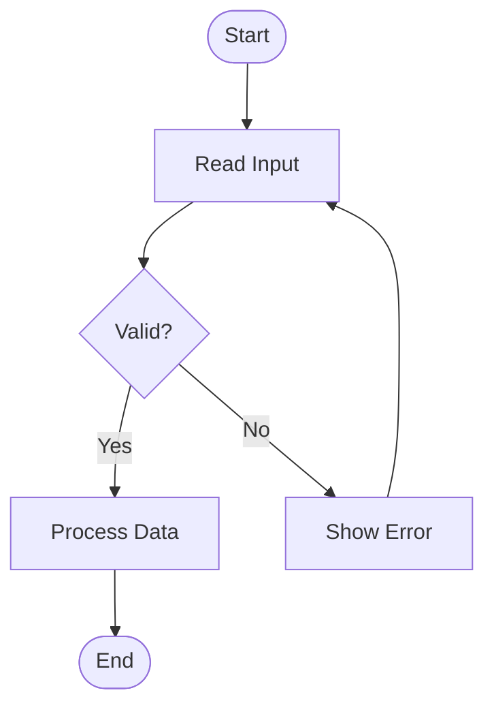
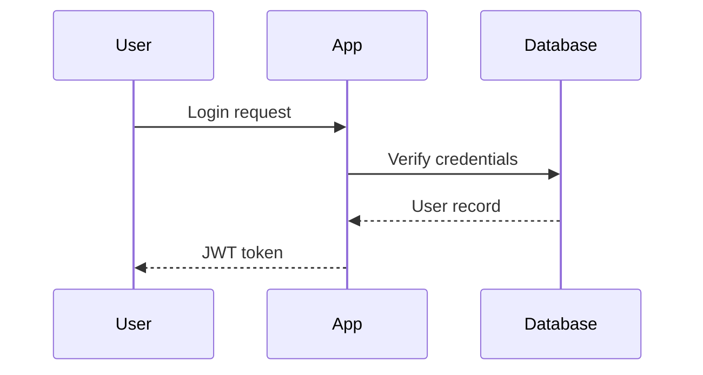
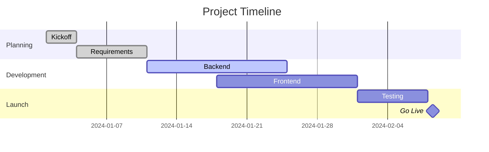

# Heading Level 1 — The Complete Markdown Reference

A comprehensive showcase of every Markdown element, from basic to advanced.
Use this file to test renderers, converters, and styling pipelines.

---

## Heading Level 2 — Table of Contents

1. [Paragraphs & Line Breaks](#paragraphs)
2. [Headings](#headings)
3. [Emphasis & Inline Formatting](#emphasis)
4. [Horizontal Rules](#horizontal-rules)
5. [Blockquotes](#blockquotes)
6. [Lists](#lists)
7. [Code](#code)
8. [Tables](#tables)
9. [Links](#links)
10. [Images](#images)
11. [Task Lists](#task-lists)
12. [Footnotes](#footnotes)
13. [Definition Lists](#definition-lists)
14. [Abbreviations](#abbreviations)
15. [Escape Characters](#escape-characters)
16. [HTML Inline](#html-inline)

---

## Heading Level 2 — Paragraphs & Line Breaks

### Heading Level 3 — Standard Paragraph

This is a standard paragraph. Markdown wraps text automatically. Lorem ipsum dolor sit amet,
consectetur adipiscing elit. Pellentesque habitant morbi tristique senectus et netus et
malesuada fames ac turpis egestas.

This is a **second paragraph**, separated by a blank line. Each blank line starts a new paragraph block.

### Heading Level 3 — Forced Line Break

This line ends with two trailing spaces, forcing a hard break.  
This is the second line of the same paragraph block.  
And this is the third line, still in the same paragraph.

---

## Heading Level 2 — All Six Heading Levels

# Heading Level 1
## Heading Level 2
### Heading Level 3
#### Heading Level 4
##### Heading Level 5
###### Heading Level 6

---

## Heading Level 2 — Emphasis & Inline Formatting

### Heading Level 3 — Bold

**This text is bold using double asterisks.**
__This text is bold using double underscores.__

### Heading Level 3 — Italic

*This text is italic using single asterisks.*
_This text is italic using single underscores._

### Heading Level 3 — Bold + Italic

***This is bold and italic using triple asterisks.***
___This is bold and italic using triple underscores.___
**_This is also bold and italic, mixed syntax._**

### Heading Level 3 — Strikethrough

~~This text has been struck through.~~
The project ~~was cancelled~~ was postponed to next quarter.

### Heading Level 3 — Inline Code

Use `print("Hello, World!")` in Python to output text.
The `--force` flag should be used with caution.
Variables like `myVariable` are case-sensitive.

### Heading Level 3 — Highlight (Extended Markdown)

Some renderers support ==highlighted text== using double equals signs.

### Heading Level 3 — Subscript & Superscript (Extended Markdown)

Chemical formula: H~2~O and CO~2~
Mathematical notation: E = mc^2^ and x^n^ + y^n^

### Heading Level 3 — Mixed Inline Styles

This sentence has **bold**, *italic*, ~~strikethrough~~, and `inline code` all in one line.
You can also combine **_bold italic_** or ~~**bold strikethrough**~~.

---

## Heading Level 2 — Horizontal Rules

Three or more hyphens:

---

Three or more asterisks:

***

Three or more underscores:

___

---

## Heading Level 2 — Blockquotes

### Heading Level 3 — Simple Blockquote

> This is a basic blockquote. It can span multiple lines
> as long as each line starts with the `>` character.

### Heading Level 3 — Blockquote with Paragraph Break

> First paragraph inside a blockquote. This demonstrates
> how content wraps inside the quoted block.
>
> Second paragraph inside the same blockquote, separated
> by a blank quoted line.

### Heading Level 3 — Nested Blockquotes

> This is the outer blockquote.
>
> > This is a nested (inner) blockquote inside the outer one.
> >
> > > And this is a third level of nesting.
>
> Back to the outer level.

### Heading Level 3 — Blockquote with Other Elements

> #### Quote with a Heading
>
> - Bullet point inside a blockquote
> - Another bullet point
>
> **Bold text** and *italic text* work inside blockquotes.
> Even `inline code` renders correctly here.

---

## Heading Level 2 — Lists

### Heading Level 3 — Unordered List (Hyphens)

- First item
- Second item
- Third item
- Fourth item

### Heading Level 3 — Unordered List (Asterisks)

* Alpha
* Beta
* Gamma
* Delta

### Heading Level 3 — Unordered List (Plus Signs)

+ One
+ Two
+ Three

### Heading Level 3 — Ordered List

1. First step
2. Second step
3. Third step
4. Fourth step
5. Fifth step

### Heading Level 3 — Ordered List (Lazy Numbering)

1. The numbers in source don't have to be sequential.
1. Markdown will auto-number them correctly.
1. This is the third item regardless of the `1.` in source.
1. And this is the fourth.

### Heading Level 3 — Nested Lists

- Fruits
    - Citrus
        - Orange
        - Lemon
        - Grapefruit
    - Berries
        - Strawberry
        - Blueberry
- Vegetables
    - Root vegetables
        - Carrot
        - Potato
    - Leafy greens
        - Spinach
        - Kale

### Heading Level 3 — Nested Mixed Lists

1. Download the repository
    - Via HTTPS: `git clone https://github.com/example/repo.git`
    - Via SSH: `git clone git@github.com:example/repo.git`
2. Install dependencies
    1. Install Node.js (v18 or higher)
    2. Run `npm install`
    3. Copy `.env.example` to `.env`
3. Start the development server
    - Run `npm run dev`
    - Open `http://localhost:3000`

### Heading Level 3 — List with Paragraphs (Loose List)

- **Item One**

  This item has a paragraph of additional explanation beneath it.
  The paragraph is indented with spaces to stay inside the list item.

- **Item Two**

  Another paragraph here. You can include multiple paragraphs per list item
  by indenting them by four spaces or one tab.

- **Item Three**

  Even code blocks can go inside list items:

  ```bash
  echo "Hello from inside a list item"
  ```

---

## Heading Level 2 — Code

### Heading Level 3 — Inline Code

Call the function with `getUserById(42)` and handle the returned `Promise<User>`.

### Heading Level 3 — Indented Code Block (4 spaces)

    function greet(name) {
        return "Hello, " + name + "!";
    }
    console.log(greet("World"));

### Heading Level 3 — Fenced Code Block (no language)

```
This is a generic fenced code block.
No syntax highlighting is applied.
    Indentation is preserved exactly.
```

### Heading Level 3 — Fenced Code Block — Bash

```bash
#!/bin/bash
# Deploy script

echo "Starting deployment..."
git pull origin main
npm install --production
pm2 restart all
echo "Deployment complete."
```

### Heading Level 3 — Fenced Code Block — Python

```python
from dataclasses import dataclass
from typing import Optional

@dataclass
class User:
    id: int
    name: str
    email: str
    role: Optional[str] = "viewer"

def get_admin_users(users: list[User]) -> list[User]:
    """Return only users with admin role."""
    return [u for u in users if u.role == "admin"]
```

### Heading Level 3 — Fenced Code Block — JavaScript

```javascript
// Async fetch with error handling
async function fetchData(endpoint) {
    try {
        const response = await fetch(`https://api.example.com/${endpoint}`);
        if (!response.ok) {
            throw new Error(`HTTP error: ${response.status}`);
        }
        const data = await response.json();
        return data;
    } catch (error) {
        console.error("Fetch failed:", error.message);
        return null;
    }
}
```

### Heading Level 3 — Fenced Code Block — PowerShell

```powershell
# Get all running services and export to CSV
Get-Service |
    Where-Object { $_.Status -eq 'Running' } |
    Select-Object Name, DisplayName, StartType |
    Export-Csv -Path ".\running-services.csv" -NoTypeInformation

Write-Host "Export complete." -ForegroundColor Green
```

### Heading Level 3 — Fenced Code Block — SQL

```sql
SELECT
    u.id,
    u.name,
    u.email,
    COUNT(o.id)  AS total_orders,
    SUM(o.total) AS lifetime_value
FROM users u
LEFT JOIN orders o ON o.user_id = u.id
WHERE u.created_at >= '2024-01-01'
GROUP BY u.id, u.name, u.email
HAVING COUNT(o.id) > 0
ORDER BY lifetime_value DESC
LIMIT 25;
```

### Heading Level 3 — Fenced Code Block — JSON

```json
{
  "name": "my-app",
  "version": "2.1.0",
  "scripts": {
    "dev": "vite",
    "build": "vite build",
    "test": "vitest run"
  },
  "dependencies": {
    "react": "^18.2.0",
    "react-dom": "^18.2.0"
  },
  "devDependencies": {
    "vite": "^5.0.0",
    "vitest": "^1.0.0"
  }
}
```

### Heading Level 3 — Fenced Code Block — YAML

```yaml
name: CI Pipeline

on:
  push:
    branches: [main, develop]
  pull_request:
    branches: [main]

jobs:
  test:
    runs-on: ubuntu-latest
    steps:
      - uses: actions/checkout@v4
      - name: Set up Node
        uses: actions/setup-node@v4
        with:
          node-version: 20
      - run: npm ci
      - run: npm test
```

---

## Heading Level 2 — Tables

### Heading Level 3 — Basic Table

| Name       | Age | City          |
|------------|-----|---------------|
| Alice      | 31  | New York      |
| Bob        | 24  | Los Angeles   |
| Carol      | 29  | Chicago       |
| Dave       | 35  | Houston       |

### Heading Level 3 — Column Alignment

| Left-Aligned | Center-Aligned | Right-Aligned |
|:-------------|:--------------:|--------------:|
| Apple        |     Banana     |         $1.20 |
| Broccoli     |     Carrot     |         $0.85 |
| Durian       |    Elderberry  |        $15.00 |

### Heading Level 3 — Table with Inline Formatting

| Feature         | Status      | Notes                              |
|-----------------|-------------|------------------------------------|
| **Bold text**   | ✅ Supported | Works in all major renderers        |
| *Italic text*   | ✅ Supported | Single asterisk or underscore       |
| `Inline code`   | ✅ Supported | Backtick-wrapped                    |
| ~~Strikethrough~~ | ✅ Supported | Double tilde (GFM extension)      |
| [Links](#)      | ✅ Supported | Standard Markdown links             |
| Images          | ⚠️ Partial  | Depends on renderer                 |

### Heading Level 3 — Wide Reference Table

| Component        | Syntax                     | Example Output         | GFM | CommonMark |
|------------------|----------------------------|------------------------|:---:|:----------:|
| Heading 1        | `# Text`                   | Large title            | ✅  |     ✅     |
| Bold             | `**Text**`                 | **Text**               | ✅  |     ✅     |
| Italic           | `*Text*`                   | *Text*                 | ✅  |     ✅     |
| Strikethrough    | `~~Text~~`                 | ~~Text~~               | ✅  |     ❌     |
| Inline code      | `` `code` ``               | `code`                 | ✅  |     ✅     |
| Fenced block     | ` ``` `                    | Code block             | ✅  |     ✅     |
| Table            | `\| col \| col \|`         | Table                  | ✅  |     ❌     |
| Task list        | `- [ ] item`               | Checkbox list          | ✅  |     ❌     |
| Footnote         | `[^1]`                     | Superscript ref        | ❌  |     ❌     |

---

## Heading Level 2 — Links

### Heading Level 3 — Inline Links

[Visit OpenAI](https://www.openai.com)
[Visit Anthropic](https://www.anthropic.com "Anthropic — AI Safety Company")

### Heading Level 3 — Reference Links

The [Markdown Guide][md-guide] is a great resource.
Check out [CommonMark][cm] for the specification.
And [GitHub Flavored Markdown][gfm] for GFM extensions.

[md-guide]: https://www.markdownguide.org
[cm]: https://commonmark.org
[gfm]: https://github.github.com/gfm/

### Heading Level 3 — Bare URL & Email (Autolinks)

<https://www.example.com>
<user@example.com>

### Heading Level 3 — Anchor / Internal Link

Jump back to [Heading Level 2 — All Six Heading Levels](#heading-level-2--all-six-heading-levels).

---

## Heading Level 2 — Images

### Heading Level 3 — Inline Image


### Heading Level 3 — Reference Image

![Alt text for reference image][logo-ref]

[logo-ref]: https://upload.wikimedia.org/wikipedia/commons/thumb/4/48/Markdown-mark.svg/208px-Markdown-mark.svg.png

### Heading Level 3 — Image as a Link

[](https://daringfireball.net/projects/markdown/)

---

## Heading Level 2 — Task Lists (GFM Extension)

### Heading Level 3 — Simple Task List

- [x] Set up repository
- [x] Write README
- [x] Configure CI pipeline
- [ ] Write unit tests
- [ ] Deploy to production
- [ ] Update documentation

### Heading Level 3 — Nested Task List

- [x] **Phase 1: Planning**
    - [x] Define project scope
    - [x] Identify stakeholders
    - [x] Create timeline
- [ ] **Phase 2: Development**
    - [x] Set up environment
    - [ ] Implement core features
    - [ ] Code review
- [ ] **Phase 3: Launch**
    - [ ] QA testing
    - [ ] Stakeholder sign-off
    - [ ] Go live

---

## Heading Level 2 — Footnotes (Extended Markdown)

Markdown was created by John Gruber in 2004.[^1]

It was designed to be readable as plain text[^2] while also converting to valid HTML.

Many extensions exist, such as GitHub Flavored Markdown[^gfm] and CommonMark.[^cm]

[^1]: John Gruber, *Daring Fireball*, 2004. https://daringfireball.net/projects/markdown/
[^2]: The philosophy of Markdown prioritizes readability above all else.
[^gfm]: GitHub Flavored Markdown adds tables, task lists, strikethrough, and more.
[^cm]: CommonMark is a strongly defined, highly compatible specification of Markdown.

---

## Heading Level 2 — Definition Lists (Extended Markdown)

Markdown
: A lightweight markup language for creating formatted text using a plain-text editor.

HTML
: HyperText Markup Language — the standard language for creating web pages.

GFM
: GitHub Flavored Markdown. A dialect of Markdown supported by GitHub with extensions.
: Also used by GitLab, Gitea, and other git platforms.

API
: Application Programming Interface. A way for two applications to communicate.

---

## Heading Level 2 — Abbreviations (Extended Markdown)

When an abbreviation is defined, every occurrence of that term in the document
gets wrapped in an `<abbr>` tag, showing the full form on hover.

*[HTML]: HyperText Markup Language
*[CSS]: Cascading Style Sheets
*[API]: Application Programming Interface
*[GFM]: GitHub Flavored Markdown
*[URL]: Uniform Resource Locator

This document uses HTML, CSS, and a public API endpoint.
The full GFM spec defines how URLs are parsed.

---

## Heading Level 2 — Escape Characters

Use a backslash `\` to escape characters that Markdown would otherwise interpret:

| Character | Escaped | Rendered |
|-----------|---------|----------|
| Asterisk  | `\*`    | \*       |
| Underscore| `\_`    | \_       |
| Backtick  | `` \` ``| \`       |
| Hash      | `\#`    | \#       |
| Pipe      | `\|`    | \|       |
| Brackets  | `\[`    | \[       |
| Backslash | `\\`    | \\       |
| Period    | `\.`    | \.       |
| Bang      | `\!`    | \!       |

---

## Heading Level 2 — HTML Inline

Markdown allows raw HTML when you need finer control.

### Heading Level 3 — Inline HTML Elements

This paragraph has a <kbd>Ctrl</kbd> + <kbd>C</kbd> keyboard shortcut example.

Chemical formula using HTML: H<sub>2</sub>O and CO<sub>2</sub>.

Math notation: E = mc<sup>2</sup>.

<mark>This text is highlighted using an HTML mark tag.</mark>

### Heading Level 3 — HTML Block

<div style="border: 2px solid #0078d4; padding: 12px; border-radius: 6px; background: #f0f6ff;">
  <strong>📘 Info Box</strong><br>
  This is a raw HTML block inside a Markdown document.
  It renders as-is in most Markdown processors.
</div>

### Heading Level 3 — HTML Table (when Markdown tables aren't enough)

<table>
  <thead>
    <tr>
      <th colspan="2">Merged Header (colspan)</th>
      <th>Normal Header</th>
    </tr>
  </thead>
  <tbody>
    <tr>
      <td rowspan="2">Merged Cell (rowspan)</td>
      <td>Row 1, Col 2</td>
      <td>Row 1, Col 3</td>
    </tr>
    <tr>
      <td>Row 2, Col 2</td>
      <td>Row 2, Col 3</td>
    </tr>
  </tbody>
</table>

---

## Heading Level 2 — Emoji (GFM / Extended)

:white_check_mark: Task complete
:warning: Proceed with caution
:x: Not supported
:bulb: Tip or idea
:rocket: Launch
:books: Documentation
:hammer_and_wrench: Tools & configuration
:zap: Performance

---

## Heading Level 2 — Math (Extended — KaTeX / MathJax)

Some Markdown renderers support LaTeX math notation:

### Heading Level 3 — Inline Math

The quadratic formula is $x = \frac{-b \pm \sqrt{b^2 - 4ac}}{2a}$.

### Heading Level 3 — Block Math

$$
\int_{-\infty}^{\infty} e^{-x^2} \, dx = \sqrt{\pi}
$$

$$
\mathbf{F} = m\mathbf{a} = m\frac{d^2\mathbf{r}}{dt^2}
$$

---

## Heading Level 2 — Mermaid Diagrams (Extended)

Some renderers (GitHub, Obsidian, GitLab) support Mermaid diagrams inside fenced blocks:

### Heading Level 3 — Flowchart



### Heading Level 3 — Sequence Diagram



### Heading Level 3 — Gantt Chart



---

## Heading Level 2 — Summary

This document demonstrated every major Markdown element:

| Category            | Elements Covered                                                    |
|---------------------|---------------------------------------------------------------------|
| **Structure**       | H1–H6 headings, paragraphs, line breaks, horizontal rules           |
| **Inline styles**   | Bold, italic, bold+italic, strikethrough, inline code, highlight    |
| **Blocks**          | Blockquotes (nested), fenced code (8 languages), indented code      |
| **Lists**           | Unordered (-, *, +), ordered, nested, loose (with paragraphs)       |
| **Tables**          | Basic, aligned columns, inline formatting, wide reference           |
| **Links & Images**  | Inline, reference, bare URL/email, image-as-link                    |
| **Extended GFM**    | Task lists, footnotes, definition lists, abbreviations, emoji       |
| **HTML**            | Inline tags, HTML blocks, colspan/rowspan tables                    |
| **Advanced**        | Math (KaTeX), Mermaid diagrams, superscript, subscript              |
| **Escaping**        | Backslash escapes for all special characters                        |

---

*Document generated as a complete Markdown component reference.*
*Last updated: 2026.*
